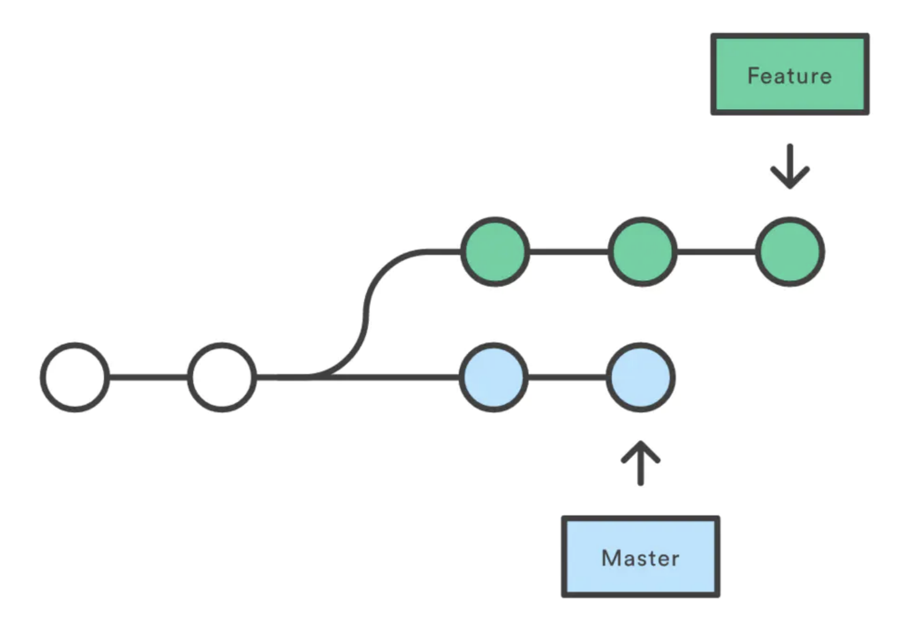
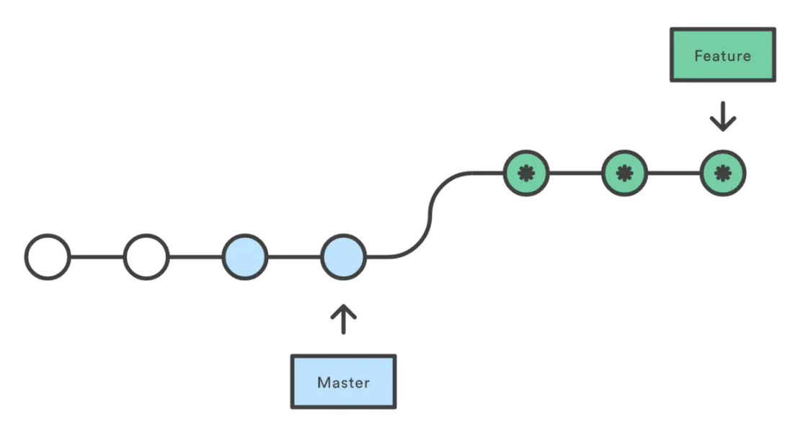
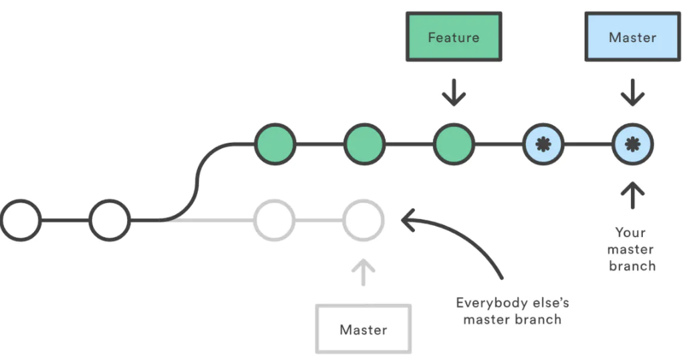

# Learn Git from Scratch
## git常用操作
```shell
git init  # 初始化项目，创建.git文件夹
git status  # 查看当前目录下文件的状态
git add [file name]  # 添加到暂存区
git commit -m 'xxx'  # 提交到git本地仓库，产生新版本
git log  # 查看所有提交的记录
git clone  # 链接、克隆远程仓库
git checkout -b [branch]  # 新建一个分支，并切换到该分支
git checkout [branch]  # 切换到某分支
git merge [branch]  # 合并指定分支到当前分支
git push  # 将本地仓库push到远程仓库
git checkout [file name]  # 在缓存区中拉取版本还原
git branch -f [branch_name] [commit id]  # 强制移动分支
git reset  # 撤销分支中某个commit之后的所有变更
git revert  # 撤销分支中某个commit，保留后面的commit，可能会有冲突，需要手动解决后重新commit  
git cherry-pick [commit id]  # 将某个commit复制到当前所在的位置（HEAD）下面
git rebase -i [commit id]  # 交互式rebase，重新排列commit id之后的commit
git tag [version] [commit id]  # 打标签
```

## pull request
1. 登录个人的github账户，对团队的github的repo进行fork。那么个人的账户下就有了团队的repo。
2. git clone个人的github repo到本地电脑。可以使用git remote -v 查看本地repo和哪些远程仓库建立了联系
3. 新建分支，修改文件，提交并push到自己的repo
   1. git add . 
   2. git commit –m "xxx" 
   3. git push [remote] [branch]
4. 在自己的repo上，点击pull-request，点击new pull request，可以添加说明和指定reviewer

## rebase

1. 解释
   1. 当执行rebase操作时，git会从两个分支的共同祖先开始提取待变基分支（一般是特性分支）上的修改，然后将待变基分支指向基分支（一般是主分支）的最新提交，最后将刚才提取的修改应用到基分支的最新提交的后面。
   2. rebase，变基，可以直接理解为改变基底。在主分支上新开了一个特性分支，但是主分支更新了，那么我们的特性分支和主分支的公共祖先就不是主分支的最新提交了，这样子提交pr比较麻烦，可以在特性分支上git rebase master，这样子就可以改变特性分支的基底为master的最新提交。结果如下：
2. 和merge的区别
   1. rebase可以对我们要操作的分支历史进行修改，比如上述在特性分支执行git rebase master之后，对于特性分支而言，它的历史提交发生了改变，新增了master分支上的改动。
      * 会合并之前的commit历史，得到更简洁的项目历史，去掉了merge commit。
      * 如果合并出现代码问题不容易定位，因为改变了history。
   2. merge会自动创建一个新的commit，如果合并的时候遇到conflict，仅需要修改后重新commit。结果如下
      * 记录了真实的commit情况，包括每个分支的详情。
      * 因为每次merge会自动产生一个merge commit，所以在使用一些git的GUI tools，特别是commit比较频繁时，看到分支很杂乱。
3. **The Golden Rule of Rebasing rebase**
   1. 千万不要再公共分支上使用rebase，如果在主分支上git rebase feature，结果如下 rebase将所有master的commit移动到你的feature的顶端。问题是：其他人还在original master上开发，由于你使用了rebase移动了master，git会认为你的主分支的历史与其他人的有分歧，会产生冲突。
4. rebase解决冲突
   1. 如果git rebase master的时候提示出现冲突，可以在解决冲突后，git add，然后再git rebase --continue。
   2. 提示冲突后，.git目录下会产生一个.COMMIT_EDITMSG.swp 的交换文件，只有 git rebase --continue 或者 --skip 或者 --abort 后，交换文件才会删掉。**所以最好有始有终，不然swg文件不太好删！**
5. 交互式rebase  
交互式```rebase```指的是使用带参数```--interactive```的```rebase```命令, 简写为 ```-i```.当 rebase UI界面打开时, 你能做3件事:  
   * 调整提交记录的顺序
   * 删除你不想要的提交
   * 合并提交

## How to pull specific directory with git
1. 添加远程仓库: ```git remote add remote_name git_ssh_link```
2. 拉取远程分支: ```git fetch remote_name branch_name```
3. 拉取某个文件夹: ```git checkout remote_name/branch_name directory_name```

## Q&A
1. Q: ```git branch -f [branch] [commit id]```和```git checkout [branch] && git reset --hard [commit id]```的区别？   
   * 前者无需修改HEAD，索引或工作副本，后者需要。
   * 如果在当前分支下做了修改并没有提交，```git checkout```无法实现，前者仍然可以正常使用。
   * 大型项目中，后者对磁盘I/O要求更高，前者只需要写入单个文件。

## .gitignore规则
1. .gitignore只能忽略那些原来没有被track的文件，如果某些文件已经被纳入了版本管理中，则修改.gitignore是无效的。
2. 解决方法：
   ```shell
   git rm -r --cached .
   git add .
   git commit -m 'update gitignore'
   ```


## 为一台电脑配置多个github账号的ssh密钥
1. 分别生成两个帐号的ssh，注意保存key的路径默认是一样的，需要修改第二个路径，否则会被覆盖掉，注意两次账号的邮箱是不一样的。
   ```shell
   ssh-keygen -t ed25519 -C "your_email@work.com"
   ```
2. 在github网页上分别添加key
3. 将ssh密钥加入ssh-agent进行管理
   1. 新建一个config文件（如果有直接修改，没有则新建），内容如下：
      ```shell
      Host github.com
		User shengjie5
		AddKeysToAgent yes
		IgnoreUnknown UseKeychain
		IdentityFile ~/.ssh/id_ed25519
	 
		Host work.com
		HostName github.com
		User shengjie55555
		AddKeysToAgent yes
		IgnoreUnknown UseKeychain
      IdentityFile ~/.ssh/id_ed25518
      ```  
4. 此时如果需要clone shengjie55555账户的repo，需要将 git@github.com:用户名/项目名.git 改成 git@work.com:用户名/项目名.git 即可（这里的work和config里面是对应的）

## tig
tig是基于终端的git客户端，基本逻辑是包含多个view: main, diff, log, tree, status, stage等等，通过不同的快捷键进入。
* main: 提交时间，作者和commit的内容，通过k/j上下移动，h打开帮助界面，q退出
* diff: 可以看到具体的文件改动，在main界面中移动光标按d/enter进入
* log: 在main界面中按l进入，类似git log，内容更详细
* tree: 在main界面按t进入，类似终端tree的效果，选中文件按e可以采用vim直接编辑
* status: 按s进入，类似git status的效果，选中没有staged的文件按u可以添加到staged文件，反之亦可，也可以移动光标到Changes not staged for commit: 然后按u直接添加所有未staged的文件
* stage: 在Unstage changes或者Staged changes行按enter进入，通过光标选中某行，按1可以添加某行到staged/unstaged文件
